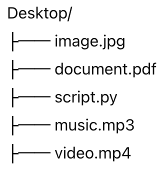
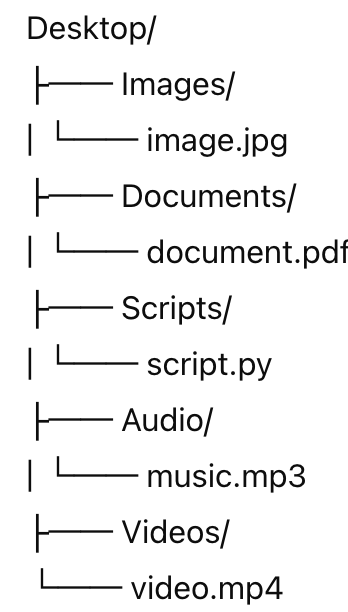

# Mac OS Desktop Organizer

The `mac-os-desktop-organizer.py` script helps you organize files on your Mac OS desktop by automatically moving files into designated folders based on their file extensions. This script categorizes files into Images, Documents, Audio, Videos, and Scripts.

## Features

- Automatically organizes desktop files into predefined categories.
- Handles duplicate file names by renaming them appropriately.
- Supports a wide range of file extensions.

### Supported File Extensions

- **Images**: `.jpg`, `.png`, `.jpeg`, `.gif`, `.webp`, `.bmp`, `.tiff`, `.svg`
- **Documents**: `.doc`, `.docx`, `.pdf`, `.xls`, `.xlsx`, `.ppt`, `.pptx`, `.txt`, `.rtf`, `.odt`
- **Audio**: `.wav`, `.mp3`, `.aac`, `.flac`, `.ogg`
- **Videos**: `.mp4`, `.avi`, `.mov`, `.wmv`, `.mkv`, `.flv`
- **Scripts**: `.py`, `.sh`, `.bat`, `.js`, `.php`, `.rb`, `.pl`

#### Prerequisites

- Python 3.x
- macOS

#### Installation

1. Clone the repository:

    ```sh
    git clone https://github.com/d0uble3L/python-automation-projects.git
    ```

2. Navigate to the project directory:

    ```sh
    cd python-automation-projects
    ```

3. Navigate to the `mac-os-desktop-organizer` directory:

    ```sh
    cd mac-os-desktop-organizer
    ```

#### Usage

1. Open a terminal and navigate to the directory where the script is located.

2. Run the script:

    ```sh
    python3 mac-os-desktop-organizer.py
    ```

3. The script will organize the files on your desktop into the following folders (creating them if they do not exist):
    - `Images`
    - `Documents`
    - `Audio`
    - `Videos`
    - `Scripts`

4. Any duplicate file names will be renamed appropriately (e.g., `file_1.txt`, `file_2.txt`).

#### Example

Before running the script, your desktop might look like this:


After running the script, your desktop will be organized as follows:


## Contributing

Contributions are welcome! Please feel free to submit a Pull Request.

## Contact

If you have any questions, feel free to contact the repository owner.

Happy Automating!
